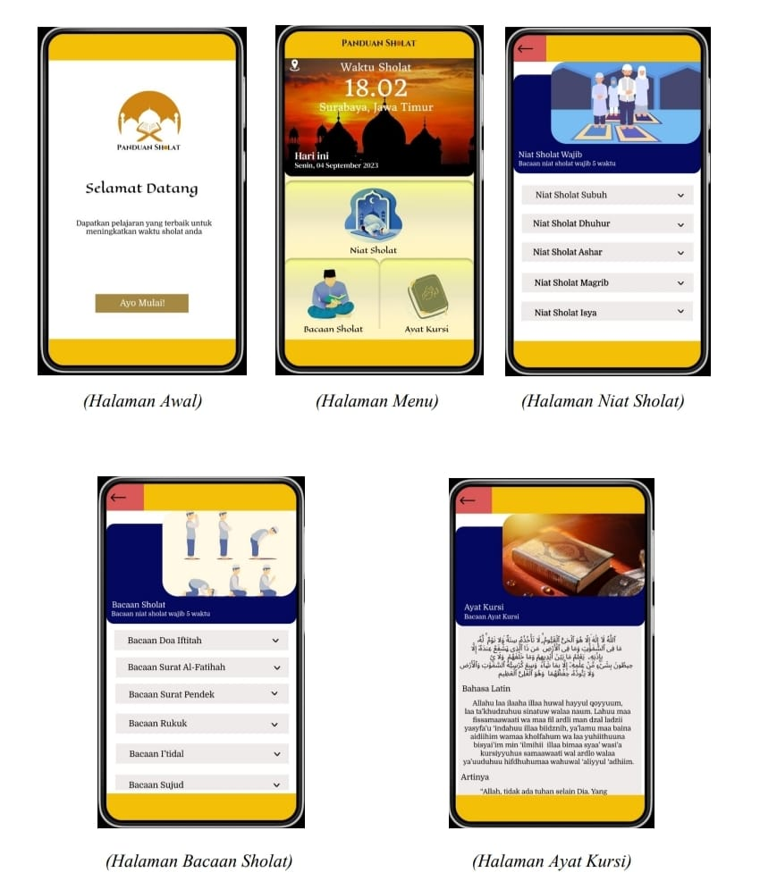

## Deskripsi Singkat
Panduan sholat adalah aplikasi yang memberikan panduan langkah demi langkah, termasuk posisi gerakan dan bacaan doa yang harus diucapkan waktu sholat.

## Fitur Aplikasi
* Halaman Awal : tampilan awal saat membuka aplikasi
* Menu : berisi 3 pilihan menu dan tampilan waktu
* Jam : tampilan jam dengan jadwal sholat
* Niat Sholat : berisi niat sholat 5 waktu lengkap
* Bacaan Sholat : doa apa saja yang akan dibaca saat sholat
* Ayat Kursi : berisi ayat kursi dengan latin, terjemahan dan tafsirannya

## Screenshoots

Aplikasi ini dibuat untuk memenuhi nilai tugas pada mata kuliah Pemrograman Mobile dari Kelompok 5 
Pendidikan Teknologi Informasi 2022, Fakultas Teknik, Universitas Negeri Surabaya

Nama Kelompok :
1. Deiva Verlyn Marjuki (22050974009)
2. Salvia Nabilah Syifa (22050974023)
3. Firdiawati   (22050974026)
4. Anindhita Rahmadini  (22050974030)

